# Hosting Your Resume on Github While Learning the Principles of Modern Technical Writing

We will go through a step by step procedure on how to host your resume on Github and how you can use the basic principles of modern technical writing mentioned in [Modern Technical Writing: An Introduction to Software Documentation by Andrew Etter ](https://www.amazon.ca/Modern-Technical-Writing-Introduction-Documentation-ebook/dp/B01A2QL9SS).

## Audience
This README is for Computer Science students who wants to learn how to host their resume on static website but have no experience with Github and static website hosting. This will also help people understand the principles of modern technical writing.

## Summary
- [Prerequisites](#prerequisites)
- [Markdown](#markdown)
- [Instructions](#instructions)
    - [Hosting the Resume](#hosting-the-resume)
    - [Changing the theme of your resume](#changing-the-theme-of-your-resume)
- [More Resources](#more-resources)
- [Author](#author)
- [Acknowledgments](#acknowledgments)
- [FAQs](#faqs)

## Prerequisites
Before starting you will need: 
- A resume formatted in Markdown 
- A Github account. You can [visit](https://github.com/) to make a Github account.
## Markdown
Markdown is a lightweight markup language with plain-text-formatting syntax and as the Etter's book mentioned it's the most widely used lightweight markup language in the world and has the cleanest syntax. You can learn the basic syntax for Markdown [here](https://www.markdownguide.org/basic-syntax/). There are number of Markdown editor available and they come in many different syntaxes. We will focus on Github Markdown.
As mentioned in the Etter's book because of the popularity of Markdown many specialized text editors exist for it. For example:  
    - [MarkdownPad(Windows)](http://www.markdownpad.com/) 
    - [iA Writer(macOS)](https://ia.net/writer) 
    - [ReText(Linux)](https://sourceforge.net/directory/development/wordprocessors/os:windows/) 
There also are many online Markdown editors. The popular ones are: 
    - [dillinger.io](https://dillinger.io/) 
    - [stackedit.io](https://stackedit.io/) 

## Instructions
Having your resume hosted at single source avoid duplication and makes updating your resume easier. As Etter's book says 
> If things change—and things always change—you only have to update the documentation in one place.  

## Hosting the Resume
Once you have a Github account and a resume formatted in Markdown you can host it on Github. Log into your Github account and the homepage of your account will open which will look this:
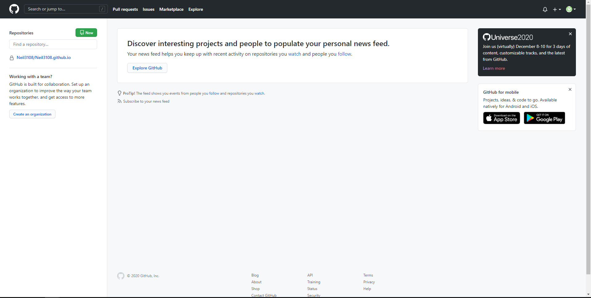

Now we just have to make a new repository and add your resume to the repository.
#### **1. Making a new Repository**
1. Click on **New** in the upper-right corner of the page to create a new repository

    

    
    

2. Once you are in the create new repository page, it will ask you to name the repository. Since we want to host our resume, we will name the repository as `YourUserName.github.io`. For example, if your username is XYZ you should name your repository `XYZ.github.io`. You can also put a little description of your repository but that is optional.

    

    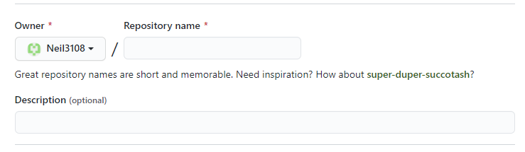
    

3. Make your repository either public or private. Since this repository will contain your resume it would be better if you make it private. (*Note: If you want to make a repository private you need Github pro. You can visit [GitHub Student Developer Pack](https://education.github.com/pack) to upgrade to Github Pro for free using your student email address.*)

    

    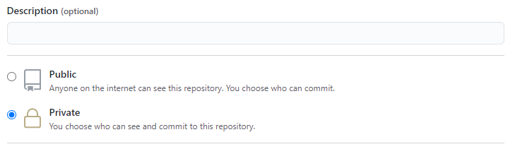
    

4. Initialize the files that you want in your repository. This is optional but since we are making a resume, we do not need any additional files.

    

    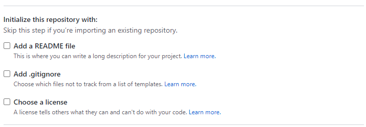
    

5. Click on **Create repository** to create the repository you initialize

    

    
    

#### **2. Adding your resume**
The file that will have your resume needs to be named `index.md`. There are two way to have your resume in repository. 
1. Making a new file and Writing your resume directly in Github.
2. Uploading the file that already have your resume formatted in Markdown.

1) **Making a new file**  
    a. Click on **Add file** at the upper center of the page and select **Create new file**.
    

    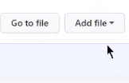
    

     
    b. Name the file `index.mb`.  
    c. Write your resume in Markdown format in the text body.  
    d. Click on **Commit** after you are done writing your resume to create a new file.  
    

    
    

     
2) **Uploading the file**  
    a. Click on **Add file** at the upper center of the page to upload a file and select **Upload files**.
    

    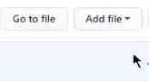
    

     
    b. Find and select the `index.md` file on your computer and click on **Commit changes** at the bottom of the page to upload the file.
    

    
    

## Changing the theme of your resume
Now that you have your resume in a repository, you can change the theme of your resume i.e. how your resume will look in a static site. Github have a lot of Jekyll based themes you can choose from. To change the theme just do the following:

1) Click on **Settings** located at the toolbar below your username. 
    

    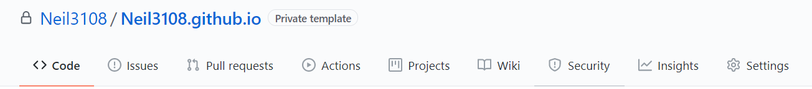
    

2) Scroll all the way down in the setting page to **Github Pages** which will look like this.
    

    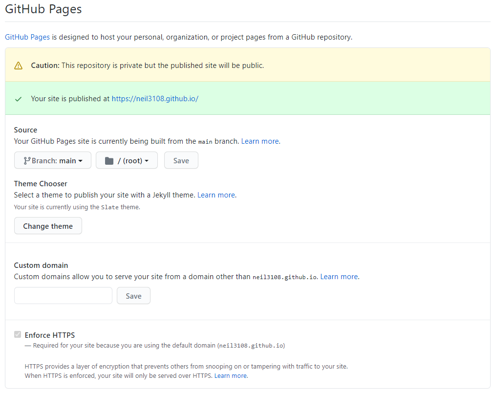
    

3) Click on **Change theme** under Theme Chooser to change the theme
    

    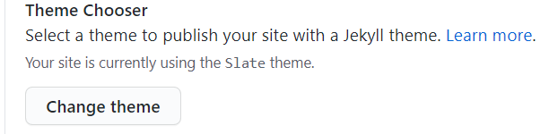
    

4) Select the theme you like and then click on **Select theme**
    

    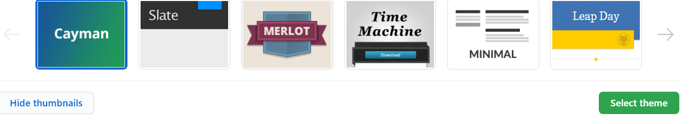
    

5) The theme of your resume is now changed! And your static website is live. To find the name of URL of the page your resume is being hosted on simply go back to the Github Pages and it will show you the URL.  
    

    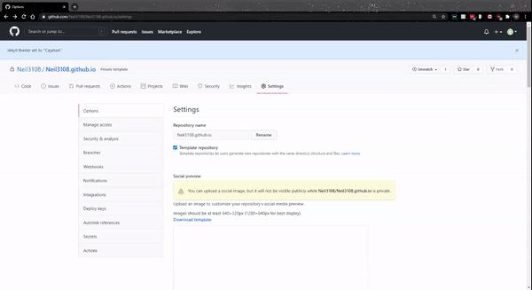
    

    
## More Resources
- [Markdown Basic Syntax](https://www.markdownguide.org/basic-syntax/)
- [In depth Markdown Tutorial](https://www.markdowntutorial.com/)
- [Modern Technical Writing: An Introduction to Software Documentation by Andrew Etter ](https://www.amazon.ca/Modern-Technical-Writing-Introduction-Documentation-ebook/dp/B01A2QL9SS)
- [dillinger.io](https://dillinger.io/)

## Author
[neil3108](https://github.com/Neil3108/)

## Acknowledgments
Resume Theme  
[cayman](https://github.com/pages-themes/cayman) by Parker Moore  

Peer reviewed by  
Marielle Manlulu [(mariellemanlulu)](https://github.com/mariellemanlulu/)  
Chris Ciceron [(chrisciceron)](https://github.com/chrisciceron)  

## FAQs
Q- I am able to edit my resume and its theme once I have uploaded it?  
Ans- Yes! You can edit your resume and change its theme as many times as you want.  

Q- Why do I need to host my resume on a static website? What is wrong with distributing resume in a PDF?  
Ans- Well, as Etter's book mentions 
> PDFs get downloaded onto hard drives and then sit there like day-old bagels, growing more and more stale until they're actively harmful.

If you want to share a resume that is always up to date, hosting it on a static website is the way to go.

